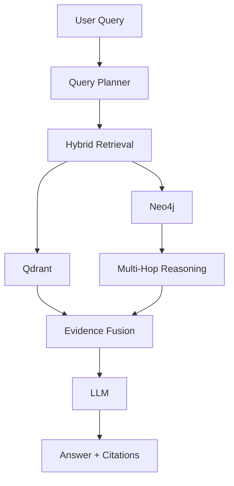
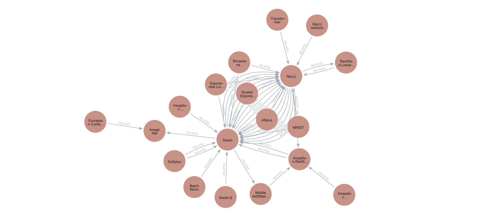

# GraphRAG — Multi-Hop Knowledge Reasoning Engine

> A hybrid Retrieval-Augmented Generation system combining semantic retrieval, knowledge graphs, and multi-hop reasoning to produce grounded, explainable answers.

## Overview

GraphRAG combines multiple sources of evidence:



Unlike vanilla vector RAG, GraphRAG can explicitly traverse relationships between entities to support multi-hop reasoning.

---

## Knowledge Graph

The knowledge graph is stored in Neo4j and contains entities, relationships,
and source provenance extracted from the documents.



---

## Technology Stack

| Component           | Technology            |
| ------------------- | --------------------- |
| Language            | Python                |
| API                 | FastAPI               |
| Relational Database | PostgreSQL            |
| Knowledge Graph     | Neo4j                 |
| Vector Database     | Qdrant                |
| Embeddings          | Sentence Transformers |
| LLM                 | Ollama                |
| PDF Processing      | PyMuPDF               |
| Testing             | Pytest                |
| Infrastructure      | Docker                |

---

## Evaluation

GraphRAG is evaluated using two complementary approaches.

### Controlled Benchmark

A synthetic multi-hop benchmark was created to isolate the retrieval problem.

The final benchmark contains:

* 110 positive queries
* 1-hop, 2-hop, and 3-hop questions
* Controlled graph relationships
* Vanilla vector RAG baseline
* GraphRAG comparison

#### Exact-Path Recall

| Query Type | Vanilla RAG | GraphRAG |
| ---------- | ----------: | -------: |
| 1-hop      |         49% |     100% |
| 2-hop      |         53% |     100% |
| 3-hop      |         51% |      97% |
| Overall    |         51% |      99% |

GraphRAG achieved **99% exact-path recall compared with 51% for vanilla vector RAG** on the controlled benchmark.

> The benchmark is synthetic and controlled, so these results demonstrate system behavior under the benchmark's defined conditions rather than general real-world performance.

---

## Real-Paper Evaluation

The system was also evaluated against the **Swish: A Self-Gated Activation Function** research paper.

The evaluation contains 15 questions covering:

* Definitions
* Mathematical formulation
* Comparison with ReLU
* Authors
* Activation properties
* Experimental evidence
* Neural network architectures
* Multi-step reasoning
* Overall conclusions

The evaluation checks:

```text
Answer Correctness
Citation Presence
Graph Evidence Usage
```

Final evaluation target:

```text
15 / 15 questions completed
Answer correctness: 100%
Citation presence: 100%
Graph evidence usage: 100%
```

The real-paper evaluator uses concept/keyword matching rather than human evaluation, so these metrics should be interpreted accordingly.

---

## Example

A multi-hop query can be represented as:

```text
Company
   │
   └── FOUNDED_BY
          │
          ▼
       Founder
          │
          └── STUDIED_AT
                 │
                 ▼
             University
```

GraphRAG can retrieve the connected path and provide the supporting evidence alongside the generated answer.

---

## Running the Project

### 1. Clone the repository

```bash
git clone <repository-url>
cd graphrag
```

### 2. Create the environment

```bash
python -m venv .venv
source .venv/bin/activate
```

On Windows:

```bash
.venv\Scripts\activate
```

### 3. Install dependencies

```bash
pip install -r requirements.txt
```

### 4. Start infrastructure

```bash
docker compose up -d
```

This starts:

```text
PostgreSQL
Neo4j
Qdrant
```

### 5. Start Ollama

Make sure Ollama is running and the configured model is available:

```bash
ollama pull llama3.2:3b
```

### 6. Index a document

```bash
python -m scripts.index_document data/pdfs/paper.pdf
```

### 7. Run the API

```bash
uvicorn apps.api.main:app --reload
```

---

## Running Evaluation

### Controlled Benchmark

Run the benchmark evaluation using the scripts inside:

```text
evaluation/benchmark/
```

### Real-Paper Evaluation

Run:

```bash
python -m evaluation.real.runner
```

Then:

```bash
python -m evaluation.real.evaluator
```

---

## Research Question

> Does combining knowledge-graph traversal with semantic retrieval improve multi-hop question answering compared with vanilla vector RAG?

The project evaluates this through controlled retrieval experiments and real-document question answering.

---


---

## Limitations

Current limitations include:

* Knowledge graph extraction depends on LLM-generated entities and relationships.
* Graph traversal currently uses deterministic traversal and heuristic ranking.
* The real-paper evaluator uses automated concept matching rather than human judgment.
* The controlled benchmark is synthetic.
* Local LLM inference can be slower than hosted inference.
* Citation presence does not by itself guarantee citation correctness.

---


## License

This project is open source and available under the MIT License.

> Stay focused, stay productive, and keep leveling up! — kaizenX out. ✌️

